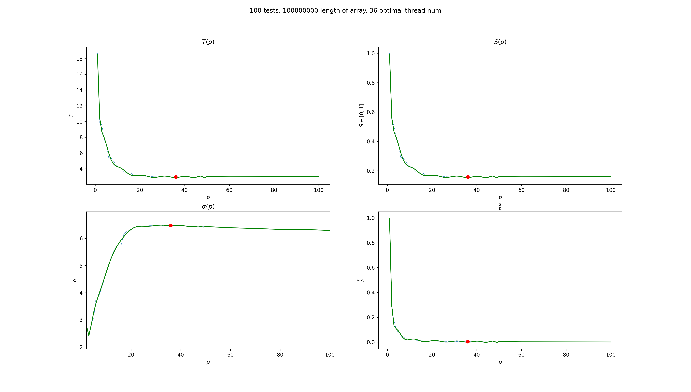

```
>>> write single sentence about me being to lazy to write this README.md by myself so i am using neural network to generate it for me. note that it may contain mistakes or misleadings.
>>> I am too lazy to write this README.md by myself, so I am utilizing a neural network to generate it for me, though it may contain errors or misleading information.
```

# Amdahl's Law Project

## Overview
This project explores Amdahl's law, which is a theoretical limit on the speedup that can be achieved by parallelizing a program. The law states that the speedup is limited by the portion of the program that cannot be parallelized. In other words, if a program has a portion that cannot be parallelized, then adding more processors will not improve the speedup beyond a certain point.

This project uses the merge-sort algorithm as an example to test Amdahl's law. The merge-sort algorithm is a sorting algorithm that can be parallelized, but not completely. Therefore, it is a good example to test the limits of Amdahl's law.

## Code Explanation

### C++ program
The program accepts command-line arguments and can be run with the following syntax:

```
./merge-sort N print numThreads
```

where:
- `N` is an integer that determines the size of the problem
- `print` is an integer flag that determines whether to print the results or not
- `numThreads` is an integer that determines the number of threads to use for computation

To parse these arguments, the following code snippet can be used:

```
int N = atoi(argv[1]);
int print = atoi(argv[2]);
int numThreads = atoi(argv[3]);
```

### Running tests
To test the performance of the program under different conditions, we can use the `test.sh` script to run the program multiple times with different parameters. The script takes three arguments: the number of tests to run, the size of the problem, and the number of threads to use for computation. It then runs the program with these parameters and records the time taken for each test.

The output of each test is not printed to the console unless the `print` flag is set to 1. Instead, the script stores the average time taken for all tests in a file named `out.txt`. This file can later be used for analysis.

To automate testing across a range of thread counts, we can use the `multitest.sh` script. This script sets an array of thread counts and runs the `test.sh` script for each count. The output from each test is appended to `out.txt`. Finally, a Python script named `analyze.py` can be used to analyze the data in `out.txt` and generate graphs or other visualizations.

Overall, this approach allows us to easily test the program's performance under different conditions and automate the process of collecting and analyzing data.

### Example of test output
Here is an example of what the "out.txt" file might contain:

```
10 1000 1 0.01
10 1000 2 0.005
10 1000 4 0.003
10 1000 8 0.002
10 10000 1 0.1
10 10000 2 0.05
10 10000 4 0.03
10 10000 8 0.02
```

Each line represents a test run of the merge-sort algorithm with a different number of threads and array length. The first number is the number of tests performed, followed by the array length, number of threads used, and the average time taken for that test.

## Analyzing data

### Amdahl's Law

Amdahl's Law is a formula used to calculate the theoretical speedup of a program when adding more processors. The formula is as follows:

```
speedup = 1 / (alpha + (1 - alpha) / n_threads)
```

where `alpha` represents the portion of the program that can be parallelized, and `n_threads` represents the number of threads used for computation.

To solve for `alpha`, we can use the following equation:

```
alpha = (n_threads - speedup) / (speedup * (n_threads - 1))
```

### Finding Optimal Thread Count

To determine the optimal number of threads for a program, we can run tests with different thread counts and record the time taken for each test. Using this data, we can calculate the speedup coefficient for every number of threads. The optimal thread count is the one that gives us the maximum speedup.

Once we have determined the optimal thread count, we can use the above formula to solve for `alpha`, which represents the portion of the program that can be parallelized.

### Python implementation
The code for this project reads in data from a file named "out.txt" in the format of "n_tests array_len num_threads avg_time". It then separates the data into two lists: num_threads_array and avg_time_array. 

```python
with open('out.txt', 'r') as f:
    for line in f:
        n_tests, array_len, num_threads, avg_time = line.strip().split()
        num_threads_array.append(int(num_threads))
        avg_time_array.append(float(avg_time))
```
Next, the code finds the optimal number of threads to use based on the minimum average time taken.

```python
optimal_num_threads = num_threads_array[avg_time_array.index(min(avg_time_array))]
```

The code then creates a 2x2 grid of subplots using matplotlib and plots the average time taken and speedup on the first row of subplots, and the parallel fraction and efficiency on the second row.

```python
fig, axs = plt.subplots(2, 2, figsize=(10, 8))
axs[0, 0].plot(num_threads_array, avg_time_array, 'bo-')
axs[0, 1].plot(num_threads_array, [avg_time_array[0]/t for t in avg_time_array], 'ro-')
axs[1, 0].plot(num_threads_array, [t/avg_time_array[0]/n for t in avg_time_array], 'go-')
axs[1, 1].plot(num_threads_array, [t/(n*t_seq) for t in avg_time_array], 'yo-')
```

For each subplot, the code sets the x-axis to be a log scale with base 2 and formats the ticks accordingly. It also sets the titles, labels, and limits for each subplot.

```python
axs[0, 0].set_xscale('log', base=2)
axs[0, 0].set_xticks(num_threads_array)
axs[0, 0].set_xticklabels(num_threads_array, rotation=45)
axs[0, 0].set_title('Average Time')
axs[0, 0].set_xlabel('Number of Threads')
axs[0, 0].set_ylabel('Time (seconds)')
axs[0, 0].set_ylim([0, max(avg_time_array)*1.2])
```

If the "approximate" flag is set to True, the code fits a polynomial curve to the data and plots it in green on top of the original data.

```python
if approximate:
    p = np.polyfit(num_threads_array, avg_time_array, deg=2)
    axs[0, 0].plot(num_threads_array, np.polyval(p, num_threads_array), 'g--')
```

Finally, the code displays the plot using plt.show().

```python
plt.show()
```

### Example of plot


## Conclusion
Amdahl's law is an important concept in parallel computing that limits the speedup that can be achieved by parallelizing a program. This project demonstrates the application of Amdahl's law to the merge-sort algorithm and provides a visual representation of the results. By understanding Amdahl's law, programmers can design more efficient parallel algorithms and optimize their programs for parallel computing.